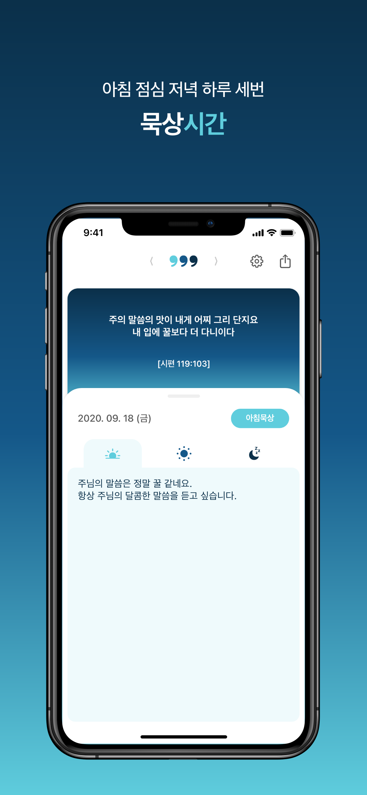
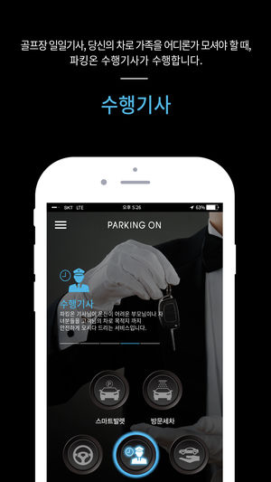
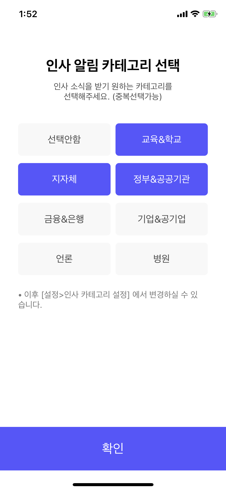
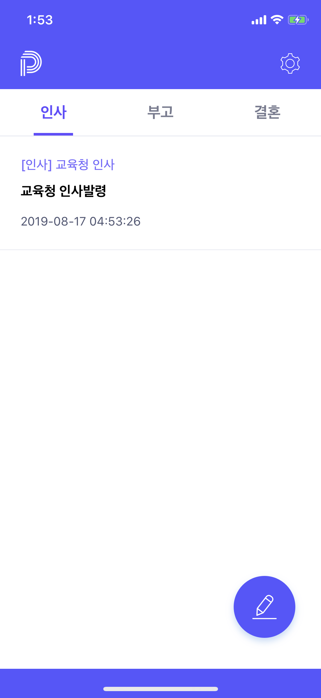

이력서
=======================
**iOS Developer**  
사람들의 생활을 더욱 편하고 즐겁게 그리고 행복하게 만들어 주는 개발자가 되겠습니다.

Github : https://github.com/swieeft

## 경력
* [펄핏](https://www.perfitt.io/)
  * 2019.10.14 ~ 2019.10.24
  * 정직원
  * iOS App 개발

* [브레인워시](http://www.fantasyleaguer.co.kr/)
  * 2019.04.29 ~ 2019.09.30
  * 정직원
  * iOS App 개발

* [헬스커넥트](https://www.hconnect.co.kr)
  * 2019.01.07 ~ 2019.04.06
  * 프리랜서
  * iOS App 개발

* [지니웍스](http://genieworks.net/)
  * 2018.05.02 ~ 2018.12.31
  * 정직원
  * iOS App 개발 및 유지보수
 
* [이엔지소프트](http://www.engsoft.kr/sub3/1.php)
  * 2016.06.28 ~ 2017.10.31
  * 정직원
  * C# Winform 프로그램 개발
  
* [소프트캠프](http://www.engsoft.kr/sub3/1.php)
  * 2015.03.16 ~ 2016.01.29
  * 정직원
  * DRM 솔루션 개발 및 유지보수
  
## 개인 프로젝트
* **삼시묵상**
  
  하루 3번의 푸시 메시지를 통해 성경을 묵상할 수 있게 해주는 iOS App
  * 기간 : 2017.12.01 ~ 2018.02.27
  * 사용기술 : Swift, Node.js, MongoDB, AWS, KakaoSDK
  * 성과 : iOS와 Swift를 공부한 후 처음 개발부터 배포까지 한 프로젝트로 iOS 앱 개발 및 서비스에 대한 이해를 할 수 있었음
  * github(App) : https://github.com/swieeft/Three_meditation_a_day
  * github(Server) : https://github.com/swieeft/Three_meditation_a_day_Server
  * [AppStore로 이동](https://apps.apple.com/app/id1343039640)
  * :exclamation:서버 서비스 종료
    
     
  
* **DrawingRecorder**

  사용자가 View에 Drawing한 데이터를 녹화 후 재생해주는 iOS App
  * 기간 : 2018.11.06 ~ 2018.11.14
  * 사용기술 : Swift
  * 성과 : Swift의 GCD를 활용한 작업을 통해 iOS의 비동기 데이터 처리 방법을 익힐 수 있었으며, Touch 정보에 대한 이해와 View Drawing 방법을 더 깊게 이해 할 수 있었음 
  * github : https://github.com/swieeft/DrawingRecorder
    
    
  
* **DotPattern-UIBezierPath**

  Swift의 UIBezierPath를 쉽게 사용할 수 있도록 도와주는 오픈소스 라이브러리
  * 기간 : 2018.08.31 ~ 2018.09.17 (ver2.0 준비중)
  * 사용기술 : Swift
  * 성과 : UIBezierPath를 사용하면서 어려웠던 포인트 계산 부분을 쉽게 해결 할 수 있었으며, UIBezierPath가 무엇인지 배울 수 있었음
  * github : https://github.com/swieeft/DotPattern-UIBezierPath
    
    
  
* **CustomView**

  프로젝트를 진행하면서 만들었던 커스텀 뷰를 정리한 저장소
  * 기간 : 2019.03.23 ~ 업데이트 예정
  * 사용기술 : Swift
  * 성과 : 커스텀 뷰를 여러가지 개발해봄으로써 뷰에 대한 이해를 더욱 깊이 있게 할 수 있었음
  * github : https://github.com/swieeft/CustomView
    
     
    
* **CardyView**

  CardView 만들기 예제
  * 기간 : 2018.10.01 ~ 2018.10.11
  * 사용기술 : Swift
  * 성과 : 처음 CardView를 구현 할 때 어려웠던 부분을 정리함으로 CardView 구현에 대한 자신감을 가질 수 있게 해주었음
  * github : https://github.com/swieeft/CardyView
      
  ☺︎
  
* **iOS-Animation**

  Swift로 구현된 iOS Animation 예제 소스들을 정리한 프로젝트
  * 기간 : 2018.09.03 ~ 업데이트 예정
  * 사용기술 : Swift
  * 성과 : Swift에서 제공하는 여러가지 애니메이션의 사용법을 익힐 수 있었음
  * github : https://github.com/swieeft/iOS-Animation
    
     
  
## 회사 프로젝트
* **Perfitt**

  사용자에게 딱 맞는 신발 사이즈를 추천해주는 신개념 서비스
  * 기간 : 2019.10.14 ~ 2019.10.24
  * 소속 : 펄핏
  * 역할 : iOS 앱 개발
  * 사용기술 : Swift, Firebase(analytics), SnapKit
  * [AppStore로 이동](https://apps.apple.com/app/id1482716497)
    
     
  
* **판타지리거**
  프로야구 경기와 실시간 연동되는 전략대결 야구게임
  * 기간 : 2019.04.29 ~ 2019.09.30
  * 소속 : 브레인워시
  * 역할 : iOS 앱 개발
  * 사용기술 : Swift, FireBase(FCM, analytics crashlytics), Vungle SDK, AWS(AppSync, Amplify), KakaoSDK(Link)
  * [AppStore로 이동](https://apps.apple.com/app/id1436459567)
    
      
 
* **코치코치 당뇨**

  사용자의 당뇨 관리를 해주는 헬스케어 앱
  * 기간 : 2019.01.07 ~ 2019.04.06
  * 소속 : 헬스커넥트
  * 역할 : iOS 앱 고도화 개발
  * 사용기술 : Swift, GoogleMap, FireBase(푸시메시지)
  * [AppStore로 이동](https://apps.apple.com/app/id1436949078)
    
     
  
* **픽앤유니크 - pick&uniq**

  소셜 커머스 서비스 앱
  * 기간 : 2018.06.04 ~ 2018.12.31
  * 소속 : 지니웍스
  * 역할 : iOS 앱 신규 개발
  * 사용기술 : Swift, FireBase(푸시메시지)
  * [AppStore로 이동](https://apps.apple.com/app/id1399458286)
    
     

* **파킹온 - ParkingOn**

  자동차 관련 O2O 서비스 앱
  * 기간 : 2018.09.03 ~ 2018.12.31
  * 소속 : 지니웍스
  * 역할 : iOS 앱 유지보수 및 신규 기능 개발
  * 사용기술 : Swift
  * [AppStore로 이동](https://apps.apple.com/app/id1049602585)
    
     

## 외주 프로젝트
* **피플 - People**

  사용자 주소록에 등록 된 이름 및 전화번호를 매칭하여 인사, 부고, 결혼 소식을 알려주는 앱
  * 기간 : 2019.01.01 ~ 2019.01.31(v1.0), 2019.06.28 ~ 2019.08.18(v2.0)
  * 역할 : iOS 앱 신규 개발
  * 사용기술 : Swift, FireBase(푸시메시지)
  * [AppStore로 이동](https://apps.apple.com/app/id1449232209)
    
      
